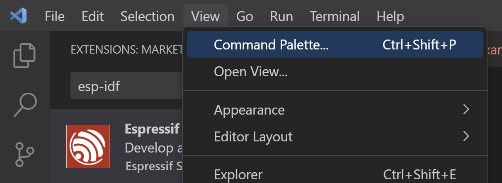

Just Logic
+++++++++++

A simple Text.

Key Goals
=======================
Testing bold and italic and codeword

Bold: **Bold**

Italics: *Italics*  

Codeword: ``Codeword``  

Bullets

* This is bullet 1
   * Subitem 1 (3 spaces required)
* This is bullet 2
* This is bullet 3

Numbering

#. This is Num 1
#. This is Num 2
    #. SubNum 2 A (4 spaces required)
    #. SubNum 2 B (4 spaces required)
#. This is Num 3

Images
=======

.. image:: /images/img1.png

Something after Image 1

CodeMaster
==========

Code Formatting

Python Code
~~~~~~~~~~~~
A Python code below

.. code-block:: python
    :emphasize-lines: 3, 6, 8

    import somelib

    # initialize sum
    sum = 0

    # find the sum of the cube of each digit
    temp = num
    while temp > 0:
        digit = temp % 10
        sum += digit ** 3
        temp //= 10

    # display the result
    if num == sum:
        print(num,"is an Armstrong number")
    else:
        print(num,"is not an Armstrong number")

End of Python Code

C++ Code
~~~~~~~~~~~~
.. code-block:: c++
    :emphasize-lines: 3, 7

    #Include "mylib.h"
    #include<iostream>
    using namespace std;

    int main()
    {
        int num1, num2, add;
        cout<<"Enter Two Numbers: ";
        cin>>num1>>num2;
        add = num1+num2;
        cout<<"\nResult = "<<add;
        cout<<endl;
        return 0;
    }

End C++ code

Tables
=======

Simple table
~~~~~~~~~~~~~

=====  =====  ======
   Inputs     Output
------------  ------
  A      B    A or B
=====  =====  ======
False  False  False
True   False  True
False  True   True
True   True   True
=====  =====  ======

Grid table
~~~~~~~~~~

+------------+------------+-----------+
| Header 1   | Header 2   | Header 3  |
+============+============+===========+
| body row 1 | column 2   | column 3  |
+------------+------------+-----------+
| body row 2 | Cells may span columns.|
+------------+------------+-----------+
| body row 3 | Cells may  | - Cells   |
+------------+ span rows. | - contain |
| body row 4 |            | - blocks. |
+------------+------------+-----------+

List Table
~~~~~~~~~~

.. list-table:: Title
   :widths: 25 25 50
   :header-rows: 1

   * - Heading row 1, column 1
     - Heading row 1, column 2
     - Heading row 1, column 3
   * - Row 1, column 1
     -
     - Row 1, column 3
   * - Row 2, column 1
     - Row 2, column 2
     - Row 2, column 3

Hyperlinks
==========

https://www.kaust.edu.sa/en

`Raspberry PI <https://www.raspberrypi.org/>`_

Hyperlink back to index : :doc:`/index`
